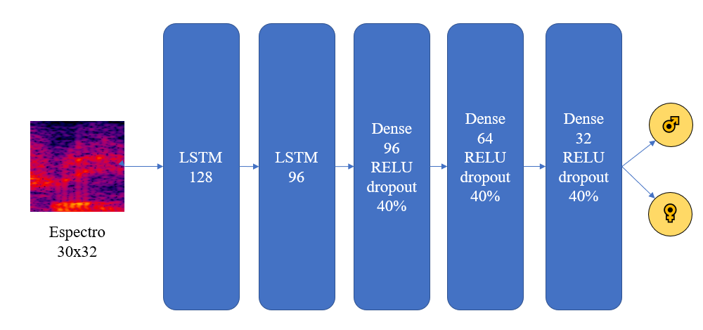

# Identificação_do_Sexo_de_Palestrantes_TED_a_partir_de_Amostras_de_Audio

#### Aluno: [Thiago Valejo Gomes Pereira](https://github.com/valejop).
#### Orientadora: [Leonardo Forero Mendoza](https://github.com/leofome8).

---

Trabalho apresentado ao curso [BI MASTER](https://ica.puc-rio.ai/bi-master) como pré-requisito para conclusão de curso e obtenção de crédito na disciplina "Projetos de Sistemas Inteligentes de Apoio à Decisão".

- [Link para o código](https://github.com/valejop/TEDlium_SexIdentification_BIMaster).

---

### Resumo

Foi criado um classificador binário com o objetivo de identificar o sexo de palestrantes de <i>TED talks</i> a partir de extratos de  2 segundos de áudio utilizando redes neurais LSTM. Os áudios foram obtidos da base de dados [TEDlium](https://www.openslr.org/51/) e a rotulagem foi feita parcialmente com uma [API](https://genderize.io/) a partir do nome do palestrante. Obteve-se para o treinamento e para o teste, respectivamente, um resultado de 91% e 81% de acurácia.

### Abstract 

A binary classificator was created aiming to identify the gender of <i>TED talks</i> lecturers from 2-seconds audio excerpts using neural networks (LSTM). The audio files were extracted from the [TEDlium]((https://www.openslr.org/51/)) dataset and the labels were partially collected feeding the lecturer name to an [API](https://genderize.io/). The accuracy achieved to the train and for the test set were, respectively, 91% and 81% accuracy.

### 1. Introdução
Para treinar o classificador, foi usada a base de dados TED-lium, contendo diversas "TED-talks" (<a href="https://www.openslr.org/51/">link  TEDlium</a>). Algumas palestras do conjunto foram deixadas de lado por 1) possuirem mais de um palestrante ou 2) serem apresentações musicais. 
A rotulagem de sexo foi feita a partir da API genderize.io. Optei por aceitar a rotulagem com mais de 95% de certeza, restando uma centena de valores para serem rotulados à mão. Dos palestrantes restantes, selecionamos uma proporção equivalente de homens e mulheres e, dentre estes, selecionamos aproximadamente 90% dos palestrantes para treino e os outros 10% para teste. A divisão de treino-teste foi realizada no nível de palestrante para evitar vazamento de dados. Dos dados de treino, 25% foram usados como conjunto de validação. 
Para cada palestrantes, foram extraídos pedaços de áudio contendo falas de 2 segundos de duração. O timeframe foi selecionado de modo que houvesse registro de legendagem na fala. 

### 2. Modelagem
Os dados no dataset estavam no formato sph com rate de 16000Hz. Mantivemos o formato por conta do alto custo computacional envolvido em transformar todos os áudios em 44100Hz. Extraimos 30 MFCC's a partir dos dados originais dentro de uma janela de 1024 frames, resultando em espectros 30x32, que foram alimentados às redes neurais. 
Foi construída uma rede neural com a seguinte disposição: 
 

### 3. Resultados
O treinamento foi feito em 200 épocas usando como callbacks parada precoce com 10 épocas de paciência e com redução de taxa de aprendizado padrão. O otimizador utilizado foi adam e função custo "SparseCategoricalCrossentropy". Foram utilizadas 2 callbacks: parada precoce e redução de taxa de aprendizado em platô. Mesmo com a parada precoce, o modelo tendeu um pouco ao sobreajuste, conforme podemos ver nos resultados contra o conjunto de validação: 
 
No conjunto de teste, conseguimos uma acurácia de 81% (contra 91% do conjunto de treino) e uma AUC de 0.88. O melhor ponto de corte teórico (KS) ficou em 53,4%. 
 
 
 

Usando como ponto de corte 50% obtivemos os seguintes resultados:
<table>
<tr><td></td><td>precision</td><td>recall</td><td>f1-score</td><td>support</td></tr>
<tr><td>    0</td><td>0.71</td><td>0.83</td><td>0.76</td><td>510</td></tr>
<tr><td>    1</td><td>0.88</td><td>0.78</td><td>0.83</td><td>804</td></tr>
<tr><td>    accuracy</td><td></td><td></td><td>0.80</td><td>1314</td></tr>
<tr><td>   macro avg</td><td>0.79</td><td>0.81</td><td>0.79</td><td>1314</td></tr>
<tr><td>weighted avg</td><td>0.81</td><td>0.80</td><td>0.80</td><td>1314</td></tr>
</table>

Usando como ponto de corte 53,4% obtivemos os seguintes resultados:
<table>
<tr><td></td><td>precision</td><td>recall</td><td>f1-score</td><td>support</td>
<tr><td>    0</td><td>0.74</td><td>0.79</td><td>0.76</td><td>510</td></tr>
<tr><td>    1</td><td>0.86</td><td>0.82</td><td>0.84</td><td>804</td></tr>
<tr><td>accuracy</td><td></td><td></td><td>0.81</td><td>1314</td></tr>
<tr><td>macro avg</td><td>0.80</td><td>0.81</td><td>0.80</td><td>1314</td></tr>
<tr><td>weighted avg</td><td>0.81</td><td>0.81</td><td>0.81</td><td>1314</td></tr>
</table>
Foi feita também uma análise dos erros por palestrante. O único erro de classificação mais grave foi referente ao palestrante Birke Baehr, um menino de 11 anos, categorizado fortemente como criança, explicando um pouco da disparidade entre o resultado da validação e teste. Outros erros se referem a vozes mais difíceis de distinguir (por ex.: vozes masculinas mais finas ou sotaques estrangeiros) 
 

### 4. Conclusões
Um classificador de gênero a partir de extratos de áudio foi criado com sucesso, obtendo uma acurácia de 81% para o conjunto de treino. Melhores resultados poderiam ser obtidos com dados mais refinados, usando áudios com 44100Hz, gerando espectros mais refinados.

---

Matrícula: 192.110.121

Pontifícia Universidade Católica do Rio de Janeiro

Curso de Pós Graduação *Business Intelligence Master*
