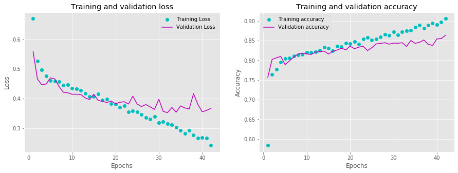
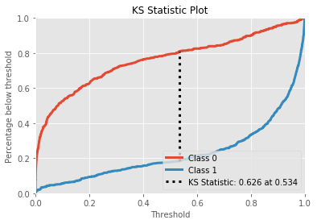
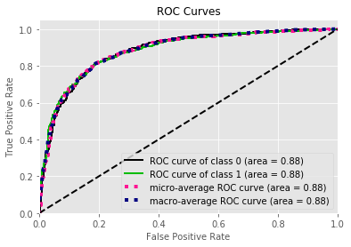
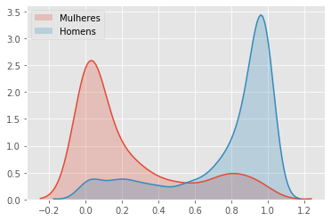
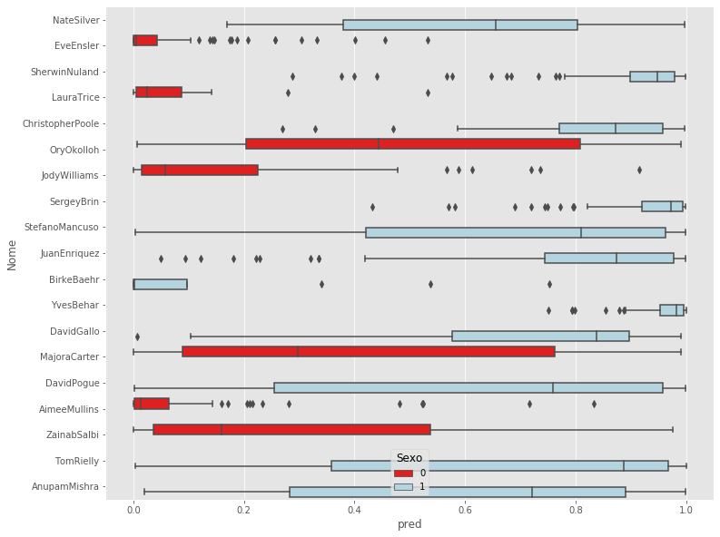

<h1> TEDlium_SexIdentification_BIMaster </h1>
Sex identification of lecturer taking 2 seconds of audio from database of audios from TED talks.

<ol>
<li><h2>Objetivo</h2></li>
Criar um classificador binário que identifique o sexo a partir de um áudio de 2 segundos.
<li><h2>Metodologia</h2></li> 
Para treinar o classificador, foi usada a base de dados TED-lium, contendo diversas "TED-talks" (<a href="https://www.openslr.org/51/">link  TEDlium</a>). Algumas palestras do conjunto foram deixadas de lado por 1) possuirem mais de um palestrante ou 2) serem apresentações musicais. 
A rotulagem de sexo foi feita a partir da API genderize.io. Optei por aceitar a rotulagem com mais de 95% de certeza, restando uma centena de valores para serem rotulados à mão. Dos palestrantes restantes, selecionamos uma proporção equivalente de homens e mulheres e, dentre estes, selecionamos aproximadamente 90% dos palestrantes para treino e os outros 10% para teste. A divisão de treino-teste foi realizada no nível de palestrante para evitar vazamento de dados. Dos dados de treino, 25% foram usados como conjunto de validação. 
Para cada palestrantes, foram extraídos pedaços de áudio contendo falas de 2 segundos de duração. O timeframe foi selecionado de modo que houvesse registro de legendagem na fala. 

<li><h2>Experimentos</h2></li> 
Os dados no dataset estavam no formato sph com rate de 16000Hz. Mantivemos o formato por conta do alto custo computacional envolvido em transformar todos os áudios em 44100Hz. Extraimos 30 MFCC's a partir dos dados originais dentro de uma janela de 1024 frames, resultando em espectros 30x32, que foram alimentados às redes neurais. 
Foi construída uma rede neural com a seguinte disposição: 
 
O treinamento foi feito em 200 épocas usando como callbacks parada precoce com 10 épocas de paciência e com redução de taxa de aprendizado padrão. O otimizador utilizado foi adam e função custo "SparseCategoricalCrossentropy". Mesmo com a parada precoce, o modelo tendeu um pouco ao sobreajuste, conforme podemos ver nos resultados contra o conjunto de validação: 
 
No conjunto de teste, conseguimos uma acurácia de 81% (contra 91% do conjunto de treino) e uma AUC de 0.88. O melhor ponto de corte teórico (KS) ficou em 53,4%. 
 
 
 

Usando como ponto de corte 50% obtivemos os seguintes resultados:
<table>
<tr><th></th><th>precision</th><th>recall</th><th>f1-score</th><th>support</th></tr>
<tr><th>    0</th><th>0.71</th><th>0.83</th><th>0.76</th><th>510</th></tr>
<tr><th>    1</th><th>0.88</th><th>0.78</th><th>0.83</th><th>804</th></tr>
<tr><th>    accuracy</th><th></th><th></th><th></th><th>0.80</th><th>1314</th></tr>
<tr><th>   macro avg</th><th>0.79</th><th>0.81</th><th>0.79</th><th>1314</th></tr>
<tr><th>weighted avg</th><th>0.81</th><th>0.80</th><th>0.80</th><th>1314</th></tr>
</table>

Usando como ponto de corte 53,4% obtivemos os seguintes resultados:
<table>
<tr><th></th><th>precision    recall  f1-score   support</th>
<tr><th>    0</th><th>0.74</th><th>0.79</th><th>0.76</th><th>510</th></tr>
<tr><th>    1</th><th>0.86</th><th>0.82</th><th>0.84</th><th>804</th></tr>
<tr><th>accuracy</th><th></th><th></th><th></th><th>0.81</th><th>1314</th></tr>
<tr><th>macro avg</th><th>0.80</th><th>0.81</th><th>0.80</th><th>1314</th></tr>
<tr><th>weighted avg</th><th>0.81</th><th>0.81</th><th>0.81</th><th>1314</th></tr>
</table>

<li><h2>Análise de erros</h2></li>
Foi feita também uma análise dos erros por palestrante. O único erro de classificação mais grave foi referente ao palestrante Birke Baehr, um menino de 11 anos, categorizado fortemente como criança, explicando um pouco da disparidade entre o resultado da validação e teste. Outros erros se referem a vozes mais difíceis de distinguir (por ex.: vozes masculinas mais finas ou sotaques estrangeiros) 
 

<li><h2>Conclusão</h2></li> 
Conseguimos criar um classificador de gênero a partir de áudio. Melhores resultados poderiam ser obtidos com dados mais refinados, usando áudios com 44100Hz, gerando espectros mais refinados.
</ol>